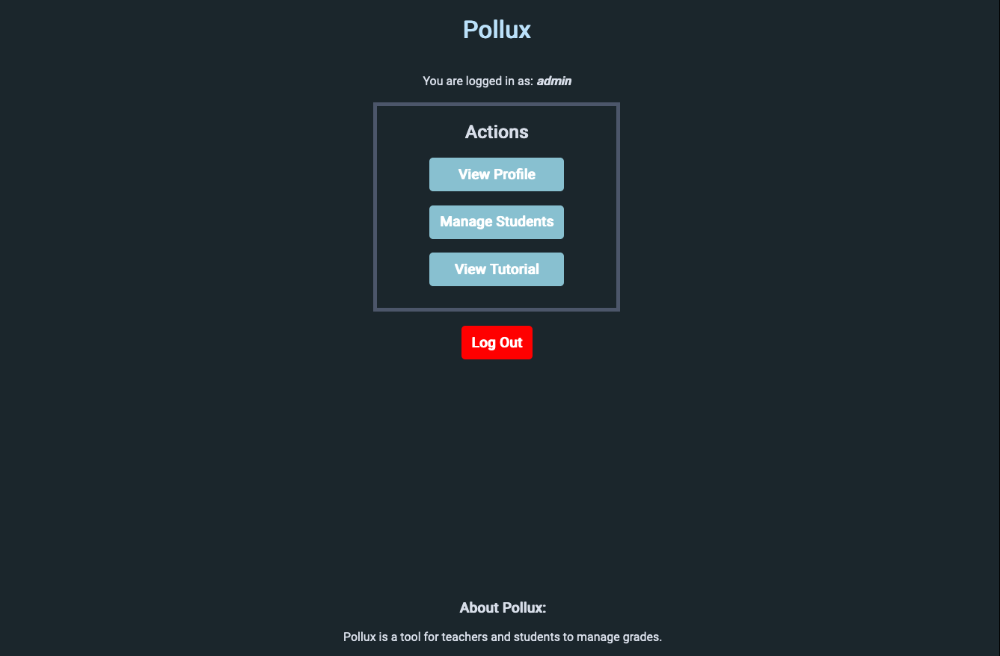

# Pollux
Grade management web app using I made as I learned PHP/MySQL. 

It uses cookies, forms, and a database to store login information and grades. The admin account (username = admin, pw= pollux123) can add student accounts and change their grades. Students can log into these accounts to view these grades.

